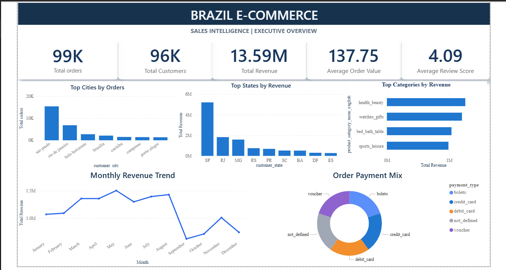
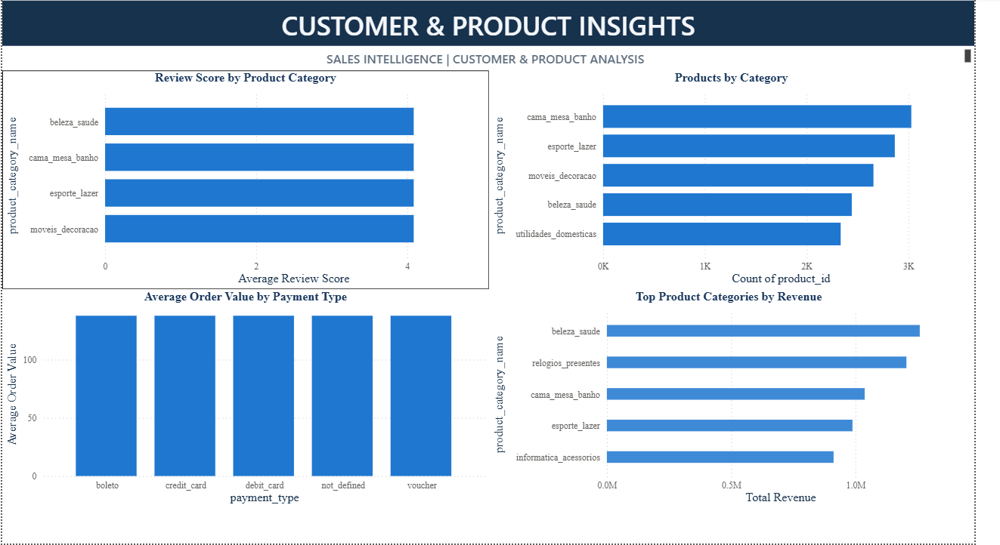
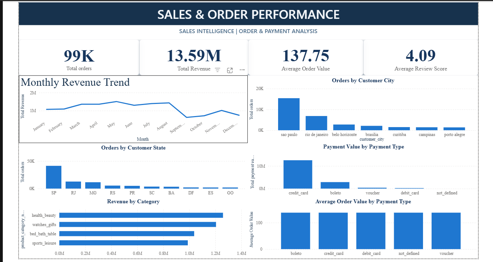
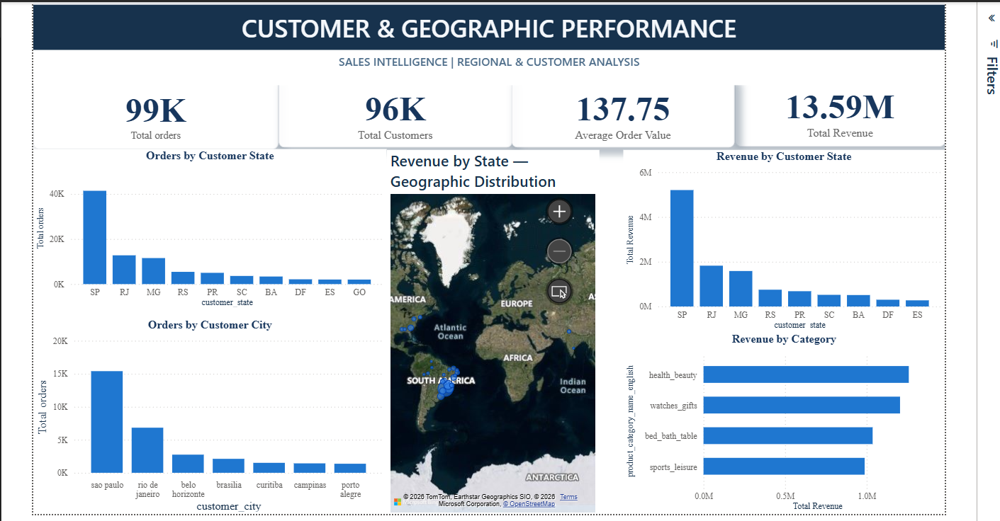
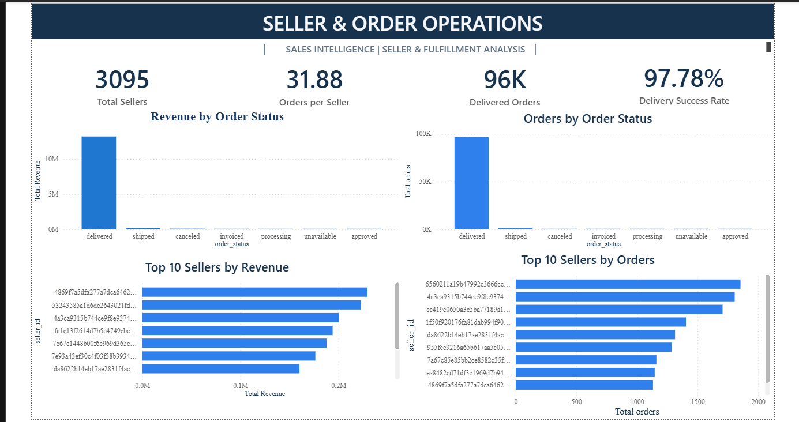
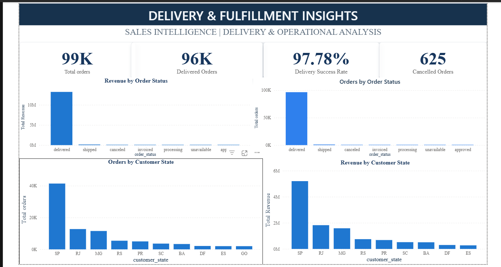
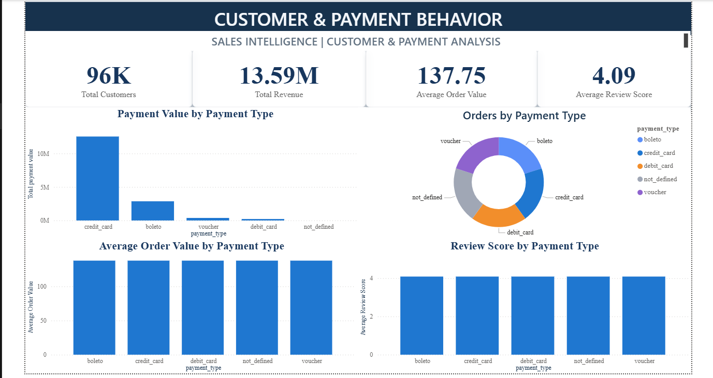
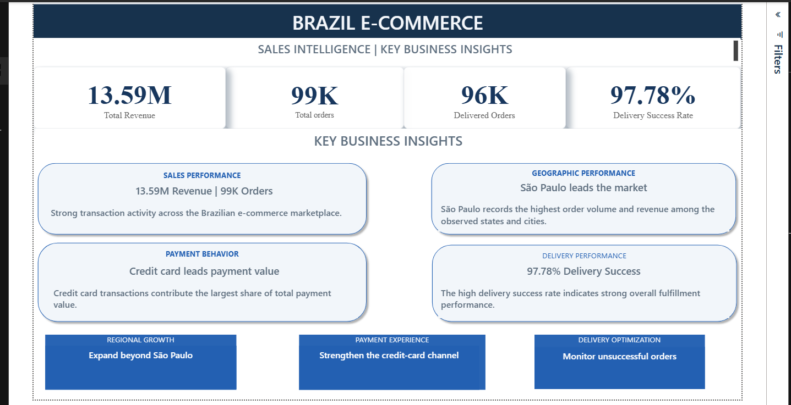

# 🇧🇷 Brazil E-Commerce Sales Intelligence Dashboard

## 📊 Project Overview

An interactive **Power BI Sales Intelligence Dashboard** developed to analyze customer behavior, sales performance, products, payments, sellers, geography, and delivery performance for a Brazilian e-commerce dataset.

The dashboard transforms raw e-commerce data into actionable business insights through interactive visualizations, KPIs, geographic analysis, and performance breakdowns.

---

## 🎯 Business Objectives

The main objectives of this project are to:

- Analyze overall sales and order performance
- Understand customer distribution and purchasing behavior
- Identify high-performing states and cities
- Analyze revenue by product category
- Evaluate seller and order performance
- Analyze payment behavior
- Monitor delivery and fulfillment performance
- Identify geographic sales patterns
- Provide an executive-level view of business performance

---

## 🛠️ Tools & Technologies

- **Power BI**
- **Power Query**
- **DAX**
- **Data Modeling**
- **Data Cleaning & Transformation**
- **Data Visualization**
- **Geographic Analysis**
- **Microsoft Bing Maps**

---

## 📌 Key KPIs

| KPI | Value |
|---|---:|
| Total Orders | 99K |
| Total Customers | 96K |
| Average Order Value | 137.75 |
| Total Revenue | 13.59M |

---

## 📑 Dashboard Pages

### 1. Executive Overview

Provides a high-level summary of the business using key performance indicators and major sales trends.

### 2. Customer & Product Insights

Analyzes customer activity and product-level performance to identify important sales patterns.

### 3. Sales & Order Performance

Provides detailed analysis of sales trends, order volume, and revenue performance.

### 4. Customer & Geographic Performance

Analyzes customer distribution and revenue across Brazilian states and cities.

### 5. Seller & Order Operations

Evaluates seller performance and order-related operational metrics.

### 6. Delivery & Fulfillment Insights

Analyzes delivery and fulfillment performance to understand operational efficiency.

### 7. Customer & Payment Behavior

Examines customer purchasing patterns and payment behavior.

### 8. Project Summary

Provides an overall summary of the dashboard, business analysis, and key findings.

---

## 🔍 Key Analysis Areas

### Sales Analysis

- Total revenue
- Total orders
- Average order value
- Revenue by state
- Revenue by product category

### Customer Analysis

- Total customers
- Orders by customer state
- Orders by customer city
- Customer purchasing behavior

### Product Analysis

- Revenue by product category
- Category-level performance
- Product sales distribution

### Geographic Analysis

- State-level customer distribution
- City-level order volume
- Geographic revenue distribution
- Interactive map visualization

### Seller & Operations Analysis

- Seller performance
- Orders by seller
- Operational performance

### Delivery Analysis

- Delivery and fulfillment performance
- Order delivery patterns
- Operational insights

### Payment Analysis

- Customer payment behavior
- Payment method analysis
- Payment-related purchasing patterns

---

## 📈 Dashboard Preview

### Executive Overview



### Customer & Product Insights



### Sales & Order Performance



### Customer & Geographic Performance



### Seller & Order Operations



### Delivery & Fulfillment Insights



### Customer & Payment Behavior



### Project Summary



---

## 🧠 Skills Demonstrated

- Data Analysis
- Business Intelligence
- Power BI Dashboard Development
- DAX
- Power Query
- Data Cleaning
- Data Transformation
- Data Modeling
- KPI Development
- Interactive Data Visualization
- Geographic Analysis
- Customer Analytics
- Sales Analytics
- Business Performance Analysis

---

## 📂 Project Structure

```text
Brazil-Ecommerce-Sales-Intelligence-Dashboard/
│
├── README.md
│
├── screenshots/
│   ├── Page1_Executive_Overview.png
│   ├── Page2_Customer_Product_Insights.png
│   ├── Page3_Sales_Order_Performance.png
│   ├── Page4_Customer_Geographic_Performance.png
│   ├── Page5_Seller_Order_Operations.png
│   ├── Page6_Delivery_Fulfillment_Insights.png
│   ├── Page7_Customer_Payment_Behavior.png
│   └── Page8_Project_Summary.png
│
└── documentation/
    └── Project-Overview.pdf
